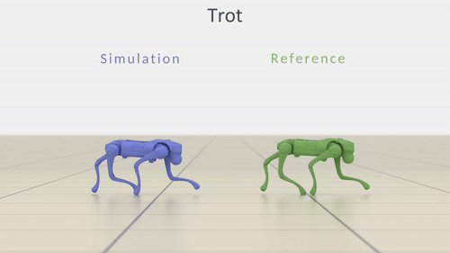

# MimicKit

<p align="center">
  
  
  
</p>

This framework provides a suite of motion imitation methods for training motion controllers. This codebase is designed to be clean and lightweight, with minimal dependencies. A more detailed overview of MimicKit is available in the [Starter Guide](https://arxiv.org/abs/2510.13794). For a more feature-rich and modular motion imitation framework, checkout [ProtoMotions](https://github.com/NVlabs/ProtoMotions/). 

This codebase includes implementations of:
- [DeepMimic](https://xbpeng.github.io/projects/DeepMimic/index.html)
- [AMP](https://xbpeng.github.io/projects/AMP/index.html)
- [ASE](https://xbpeng.github.io/projects/ASE/index.html)
- [ADD](https://xbpeng.github.io/projects/ADD/index.html)

We also include the following RL algorithms:
- [PPO](https://arxiv.org/abs/1707.06347)
- [AWR](https://xbpeng.github.io/projects/AWR/index.html)

---

## Installation

This framework supports different simulator backends (referred to as `Engines`). First, install the simulator of your choice. We highly recommend using a package manager, like [Conda](https://docs.conda.io/projects/conda/en/stable/user-guide/install/index.html), to create dedicated Python environments for each simulator.

<details>
<summary>Isaac Gym</summary>

Install [Isaac Gym](https://developer.nvidia.com/isaac-gym).

To use Isaac Gym, specify the argument `--engine_config data/engines/isaac_gym_engine.yaml` when running the code.
</details>

<details>
<summary>Isaac Lab</summary>

Install [Isaac Lab](https://isaac-sim.github.io/IsaacLab/main/source/setup/installation/index.html). This framework has been tested with `2ed331acfcbb1b96c47b190564476511836c3754`.

To use Isaac Lab, specify the argument `--engine_config data/engines/isaac_lab_engine.yaml` when running the code.
</details>

<details>
<summary>Newton</summary>

Install [Newton](https://newton-physics.github.io/newton/guide/installation.html).

To use Newton, specify the argument `--engine_config data/engines/newton_engine.yaml` when running the code. This framework has been tested with `510f16b4c83ee662c03325c2a960a924e0b5f03e`.
</details>

After that, install the requirements:
```
pip install -r requirements.txt
```
Download assets and motion data from [here](https://1sfu-my.sharepoint.com/:u:/g/personal/xbpeng_sfu_ca/EclKq9pwdOBAl-17SogfMW0Bved4sodZBQ_5eZCiz9O--w?e=bqXBaa), then extract the contents into [`data/`](data/).


---

## Training

To train a model, run the following command:
```
python mimickit/run.py --mode train --num_envs 4096 --engine_config data/engines/isaac_gym_engine.yaml --env_config data/envs/deepmimic_humanoid_env.yaml --agent_config data/agents/deepmimic_humanoid_ppo_agent.yaml --visualize true --out_dir output/
```
- `--mode` selects either `train` or `test` mode.
- `--num_envs` the number of parallel environments used for simulation. Not all environments support parallel envs, this is mainly used for Isaac Gym envs and other environments, like DeepMind Control Suite does not support this feature and should therefore use 1 for the number of envs.
- `--engine_config` configuration file for the engine to select between different simulator backends.
- `--env_config` configuration file for the environment.
- `--agent_config` configuration file for the agent.
- `--visualize` enables visualization. Rendering should be disabled for faster training.
- `--out_dir` the output directory where the models and logs will be saved.
- `--logger` the logger used to record training stats. The options are TensorBoard `tb` or `wandb`.

Instead of specifying all arguments through the command line, arguments can also be loaded from an `arg_file`:
```
python mimickit/run.py --arg_file args/deepmimic_humanoid_ppo_args.txt --visualize true
```
The arguments in `arg_file` are treated the same as command line arguments. Arguments for all algorithms are provided in [`args/`](args/).


## Testing

To test a model, run the following command:
```
python mimickit/run.py --arg_file args/deepmimic_humanoid_ppo_args.txt --num_envs 4 --visualize true --mode test --model_file data/models/deepmimic_humanoid_spinkick_model.pt
```
- `--model_file` specifies the `.pt` file that contains the parameters of the trained model. Pretrained models are available in [`data/models/`](data/models/), and the corresponding training log files are available in [`data/logs/`](data/logs/).


## Distributed Training

To use distributed training with multi-CPU or multi-GPU:
```
python mimickit/run.py --arg_file args/deepmimic_humanoid_ppo_args.txt --devices cuda:0 cuda:1
``` 
- `--devices` specifies the devices used for training, which can be `cpu` or `cuda:{i}`. Multiple devices can be provided to parallelize training across multiple processes.


## Methods

More detailed instructions for each method are available here:
- [DeepMimic](docs/README_DeepMimic.md)
- [AMP](docs/README_AMP.md)
- [ASE](docs/README_ASE.md)
- [ADD](docs/README_ADD.md)


## Visualizer UI

- **Camera control:** Hold `Alt` key and drag with the left mouse button to pan the camera. Scroll with the mouse wheel to zoom in/out.
- **Pause Simulation:** `Enter` key can be used to pause/unpause the simulation
- **Step Simulation:** `Space` key can be used to step the simulator one step at a time.


## Visualizing Training Logs

When using the TensorBoard logger during training, a TensorBoard `events` file will be saved in the same output directory as the log file. The log can be viewed with:
```
tensorboard --logdir=output/ --port=6006 --samples_per_plugin scalars=999999
```
The output `log.txt` file can also be plotted using the plotting script [`plot_log.py`](tools/plot_log/plot_log.py).

---

## Motion Data
Motion data is stored in [`data/motions/`](data/motions/). The `motion_file` field in the environment configuration file can be used to specify the reference motion clip. In addition to imitating individual motion clips, `motion_file` can also specify a dataset file, located in [`data/datasets/`](data/datasets/), which will train a model to imitate a dataset containing multiple motion clips.

The `view_motion` environment can be used to visualize motion clips:
```
python mimickit/run.py --mode test --arg_file args/view_motion_humanoid_args.txt --visualize true
```

Motion clips are represented by the `Motion` class implemented in [`motion.py`](mimickit/anim/motion.py). Each motion clip is stored in a `.pkl` file. Each frame in a motion specifies the pose of the character according to
```
[root position (3D), root rotation (3D), joint rotations]
```
where 3D rotations are specified using 3D exponential maps. Joint rotations are recorded in the order that the joints are specified in the `.xml` file (i.e. depth-first traversal of the kinematic tree). For example, in the case of [`humanoid.xml`](data/assets/humanoid/humanoid.xml), each frame is represented as
```
[root position (3D), root rotation (3D), abdomen (3D), neck (3D), right_shoulder (3D), right_elbow (1D), left_shoulder (3D), left_elbow (1D), right_hip (3D), right_knee (1D), right_ankle (3D), left_hip (3D), left_knee (1D), left_ankle (3D)]
```
The rotations of 3D joints are represented using 3D exponential maps, and the rotations of 1D joints are represented using 1D rotation angles.


## Motion Retargeting
Motion retargeting can be done using [GMR](https://github.com/YanjieZe/GMR). A script to convert GMR files to the MimicKit format is available in [`tools/gmr_to_mimickit/`](tools/gmr_to_mimickit/).

---

## Citation
If you find this codebase helpful, please cite:
```
@article{
      MimicKitPeng2025,
      title={MimicKit: A Reinforcement Learning Framework for Motion Imitation and Control}, 
      author={Peng, Xue Bin},
      year={2025},
      eprint={2510.13794},
      archivePrefix={arXiv},
      primaryClass={cs.GR},
      url={https://arxiv.org/abs/2510.13794}, 
}
```
Please also consider citing the relevant papers:
```
@article{
	2018-TOG-deepMimic,
	author = {Peng, Xue Bin and Abbeel, Pieter and Levine, Sergey and van de Panne, Michiel},
	title = {DeepMimic: Example-guided Deep Reinforcement Learning of Physics-based Character Skills},
	journal = {ACM Trans. Graph.},
	issue_date = {August 2018},
	volume = {37},
	number = {4},
	month = jul,
	year = {2018},
	issn = {0730-0301},
	pages = {143:1--143:14},
	articleno = {143},
	numpages = {14},
	url = {http://doi.acm.org/10.1145/3197517.3201311},
	doi = {10.1145/3197517.3201311},
	acmid = {3201311},
	publisher = {ACM},
	address = {New York, NY, USA},
	keywords = {motion control, physics-based character animation, reinforcement learning},
}

@article{
	AWRPeng19,
	author = {Xue Bin Peng and Aviral Kumar and Grace Zhang and Sergey Levine},
	title = {Advantage-Weighted Regression: Simple and Scalable Off-Policy Reinforcement Learning},
	journal = {CoRR},
	volume = {abs/1910.00177},
	year = {2019},
	url = {https://arxiv.org/abs/1910.00177},
	archivePrefix = {arXiv},
	eprint = {1910.00177},
	timestamp = {Tue, 01 October 2019 11:27:50 +0200},
	bibsource = {dblp computer science bibliography, https://dblp.org}
}

@article{
	2021-TOG-AMP,
	author = {Peng, Xue Bin and Ma, Ze and Abbeel, Pieter and Levine, Sergey and Kanazawa, Angjoo},
	title = {AMP: Adversarial Motion Priors for Stylized Physics-Based Character Control},
	journal = {ACM Trans. Graph.},
	issue_date = {August 2021},
	volume = {40},
	number = {4},
	month = jul,
	year = {2021},
	articleno = {1},
	numpages = {15},
	url = {http://doi.acm.org/10.1145/3450626.3459670},
	doi = {10.1145/3450626.3459670},
	publisher = {ACM},
	address = {New York, NY, USA},
	keywords = {motion control, physics-based character animation, reinforcement learning},
}

@article{
	2022-TOG-ASE,
	author = {Peng, Xue Bin and Guo, Yunrong and Halper, Lina and Levine, Sergey and Fidler, Sanja},
	title = {ASE: Large-scale Reusable Adversarial Skill Embeddings for Physically Simulated Characters},
	journal = {ACM Trans. Graph.},
	issue_date = {August 2022},
	volume = {41},
	number = {4},
	month = jul,
	year = {2022},
	articleno = {94},
	publisher = {ACM},
	address = {New York, NY, USA},
	keywords = {motion control, physics-based character animation, reinforcement learning}
}

@inproceedings{
	xu2025parc,
	author = {Xu, Michael and Shi, Yi and Yin, KangKang and Peng, Xue Bin},
	title = {PARC: Physics-based Augmentation with Reinforcement Learning for Character Controllers},
	year = {2025},
	isbn = {9798400715402},
	publisher = {Association for Computing Machinery},
	address = {New York, NY, USA},
	url = {https://doi.org/10.1145/3721238.3730616},
	doi = {10.1145/3721238.3730616},
	booktitle = {Proceedings of the Special Interest Group on Computer Graphics and Interactive Techniques Conference Conference Papers},
	articleno = {131},
	numpages = {11},
	series = {SIGGRAPH Conference Papers '25}
}

@inproceedings{
	zhang2025ADD,
    author={Zhang, Ziyu and Bashkirov, Sergey and Yang, Dun and Shi, Yi and Taylor, Michael and Peng, Xue Bin},
    title = {Physics-Based Motion Imitation with Adversarial Differential Discriminators},
    year = {2025},
    booktitle = {SIGGRAPH Asia 2025 Conference Papers (SIGGRAPH Asia '25 Conference Papers)}
}
```
